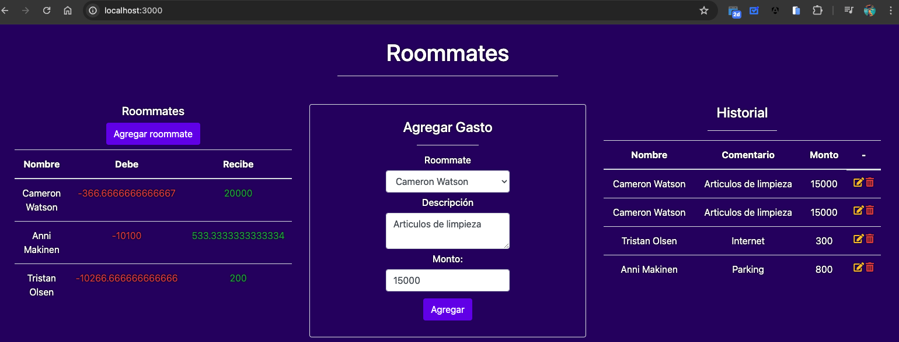

# Titulo del proyecto

App Room Mates

## Descripción del proyecto

Se busca crear un servidor con Node que sirva una interfaz HTML, cuya temática está basada en el registro
de gastos entre roommates. 


## Capturas de Pantalla del Proyecto



Vista de una de las consultas solicitadas

## Prerrequisitos o Dependencias

Se necesita las dependencias axios, dotenv, express, nodemailer, uuid

## Instalación del Proyecto


```bash
npm init -y
```


```bash
npm i express pg dotenv
```

## Licencia

Este proyecto está bajo la Licencia MIT - ve el archivo [licence.md](LICENSE) para detalles

---
